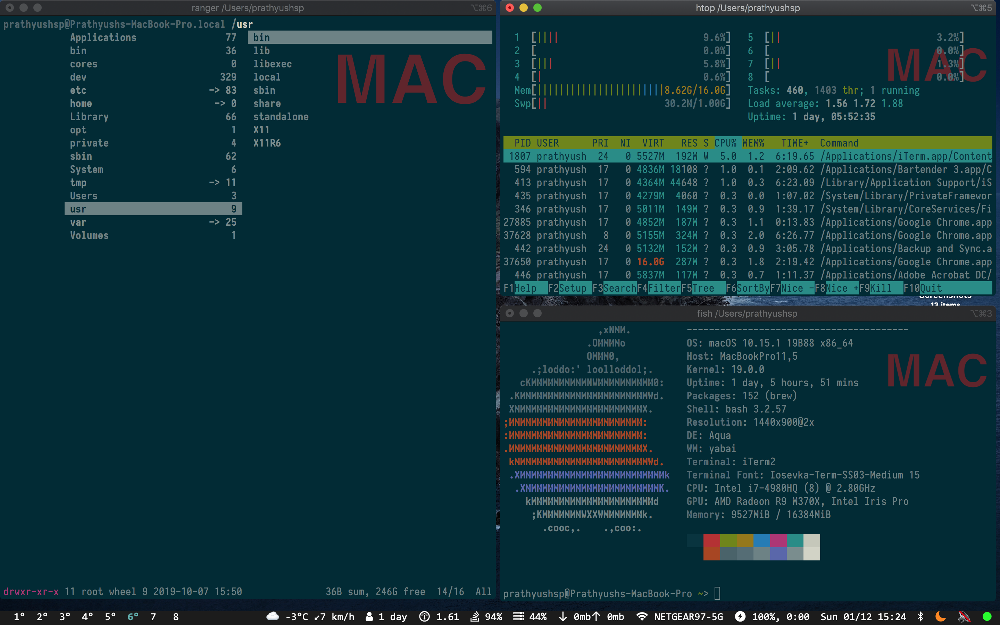

# Pbar

Simple [Übersicht](https://github.com/felixhageloh/uebersicht) widget status bar with [yabai](https://github.com/koekeishiya/yabai) support.

Originally forked from https://github.com/kkga/nibar. 
## Screenshot



## Installation

Clone this repo to your Übersicht widgets directory.

```bash
$ git clone https://github.com/kkga/nibar $HOME/Library/Application\ Support/Übersicht/widgets/nibar
```

## Dependencies

- [jq](https://github.com/stedolan/jq) — used for parsing json output and displaying the workspaces widget
    - install with homebrew: `brew install jq`
- [SF Fonts](https://developer.apple.com/fonts/) (optional) — used for symbols in the statusbar widget

## Usage

The widgets for displaying yabai workspaces aren't refreshing automatically.

To refresh them, you can add these lines utilizing [yabai's signals](https://github.com/koekeishiya/yabai/wiki/Commands#automation-with-rules-and-signals) at the end of `.yabairc`:

```sh
# refresh primary display workspaces
yabai -m signal --add event=space_changed \
    action="osascript -e 'tell application \"Übersicht\" to refresh widget id \"nibar-spaces-primary-jsx\"'"

# refresh secondary display workspaces
yabai -m signal --add event=space_changed \
    action="osascript -e 'tell application \"Übersicht\" to refresh widget id \"nibar-spaces-secondary-jsx\"'"
```

## Requirements
```bash
brew install blueutil
```

## Features
1. Volume Status
2. Clock
3. Date and Day
4. Battery % with Remaining Time (Changes during charging)
5. CPU Usage
6. WiFi AP
7. Network Usage
8. HDD Usage
9. RAM Usage
10. Up Time
11. VPN Status
12. Bluetooth Status
13. Weather Status
14. Temperature
15. Wind Speed
16. DND
17. Caffeinate


## TODO

- [ ] add support for `visible` (not `focused`) workspaces
- [ ] fix issue with Network Usage
- [ ] add support for fan throttling
